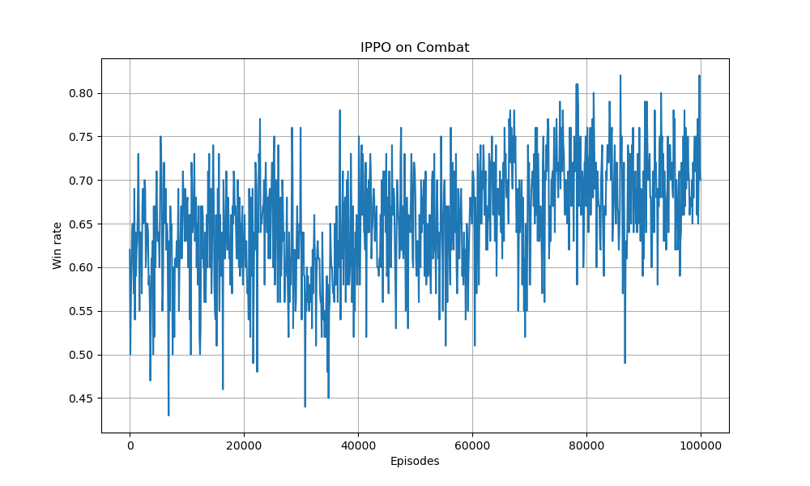

# IPPO_Project



## Overview
Inter-agent Policy Optimization (IPPO) implementation for multi-agent combat environment. This project demonstrates training multiple agents to collaborate in a combat scenario using Proximal Policy Optimization (PPO) algorithm.

## Installation

1. Clone the repository:
   ```bash
   git clone https://github.com/xiaoshengdianzi/IPPO_Project.git
   cd IPPO_Project
   ```

2. Create and activate virtual environment:
   ```bash
   python -m venv .venv
   .venv\Scripts\activate
   ```

3. Install dependencies:
   ```bash
   pip install -r requirements.txt
   ```

## Usage

### Training Command
```bash
python scripts/train.py
```

### Prediction Command
```bash
python scripts/predict.py
```

### Configuration
Edit `config.py` to adjust training parameters:
- `team_size`: Number of agents per team (2 or 5)
- `grid_size`: Grid size for the combat environment
- `num_episodes`: Total training episodes
- `actor_lr`/`critic_lr`: Learning rates for actor and critic networks
- `win_reward`/`lose_penalty`: Reward configuration

## Results


## Project Structure
```
├── scripts/
│   ├── train.py            # Training script
│   ├── predict.py          # Prediction script
│   └── test_visualization.py  # Visualization test
├── models/
│   ├── ppo.py              # PPO algorithm implementation
│   └── networks.py         # Neural network definitions
├── utils/
│   ├── env_utils.py        # Environment utilities
│   ├── plot_utils.py       # Plotting utilities
│   └── rl_utils.py         # Reinforcement learning utilities
├── ma-gym/                 # Multi-agent gym environment
├── saved_models/           # Saved model weights
├── results/                # Prediction and visualization results
├── config.py               # Configuration file
├── requirements.txt        # Project dependencies
├── README.md               # Project documentation
└── LICENSE                 # License file
```

## Contributing
How to contribute to the project.

## License
This project is licensed under the MIT license.
