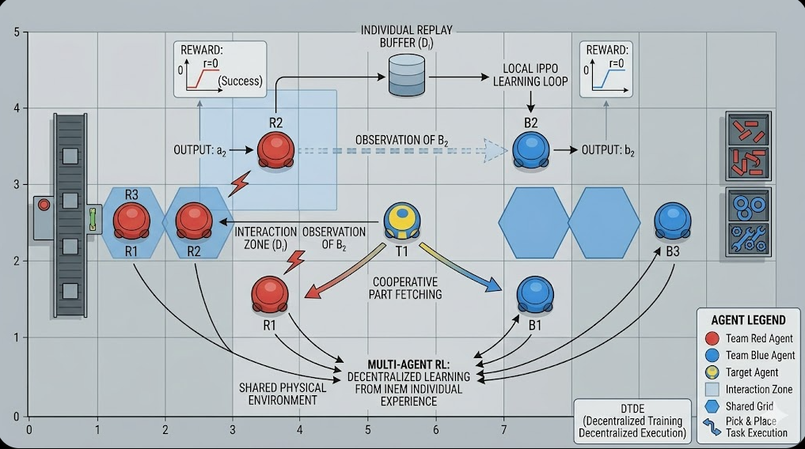
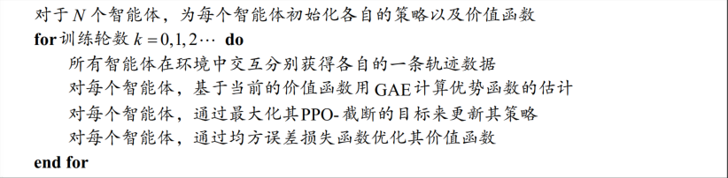
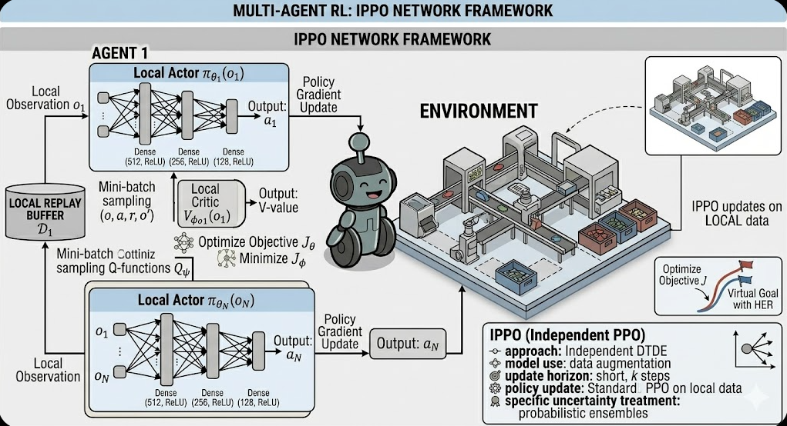
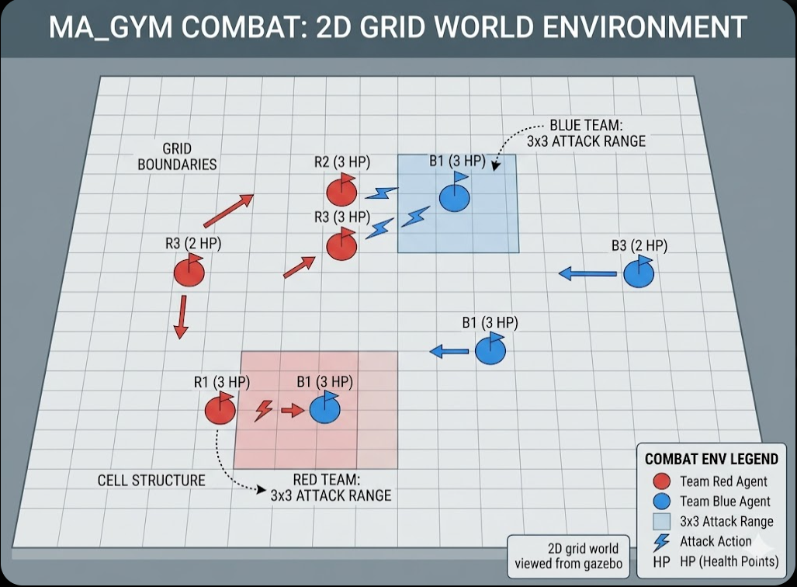
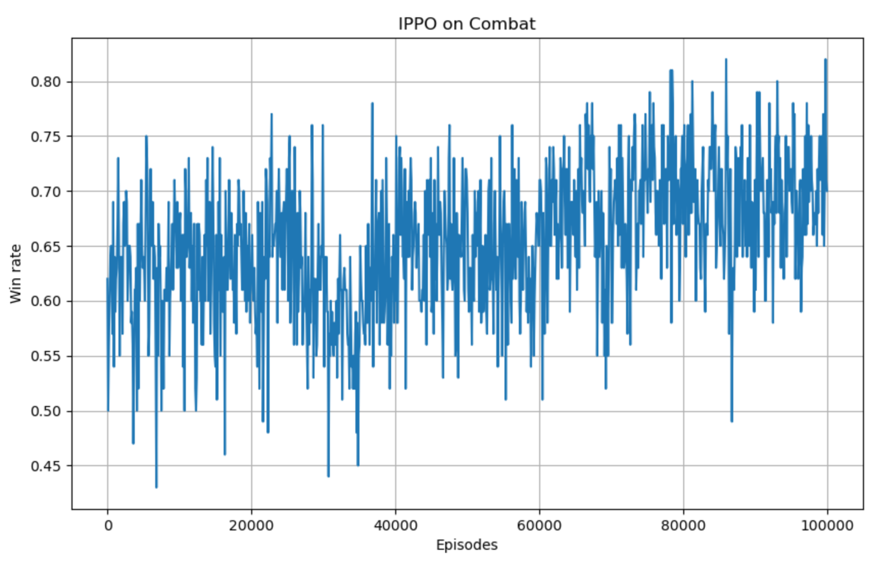
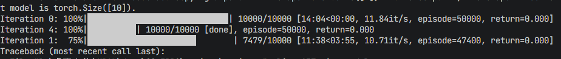
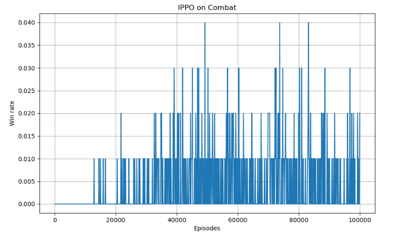

# IPPO_Project

## 项目概述
本项目实现了独立近端策略优化（Independent Proximal Policy Optimization, IPPO）算法，用于多智能体对战环境。通过近端策略优化（PPO）算法训练多个智能体在战斗场景中进行协作。



多智能体强化学习（Multi-Agent Reinforcement Learning, MARL）是强化学习领域的重要分支，相比单智能体强化学习，MARL面临着更多挑战：
- **非稳态环境**：多个智能体实时动态交互，环境对单个智能体而言是非稳态的
- **多目标优化**：不同智能体需要最大化各自的利益
- **训练复杂度**：需要大规模分布式训练来提高效率

## IPPO 算法原理

### 背景：MARL 的两个极端流派
在多智能体领域，处理多个智能体之间关系的方法主要分为两个极端：

**A. 完全中心化方法 (Fully Centralized)**
- **做法**：由一个"超级大脑"同时观察所有智能体的观测值 $\mathbf{s} = [s_1, s_2, \dots, s_n]$，并直接输出所有人的联合动作 $\mathbf{a} = [a_1, a_2, \dots, a_n]$。
- **优点**：信息完全透明，不存在非平稳性问题，理论上能达到全局最优。
- **痛点**：维度爆炸。动作空间随智能体数量指数级增长。如果每个机器人有 5 个动作，10 个机器人就是 $5^{10}$ 个动作，模型根本无法训练。

**B. 完全去中心化方法 (Fully Decentralized)**
- **做法**：每个智能体 $i$ 只看自己的 $s_i$，只更新自己的 $\theta_i$。
- **优点**：简单、扩展性极强（增加机器人数量不需要改架构）。
- **痛点**：环境非平稳性(Non-stationarity)。由于队友也在学习，导致智能体 $i$ 观察到的环境规律一直在变，容易导致训练震荡甚至不收敛。

### 核心思想
IPPO (Independent PPO) 采用"大道至简"的思想，让每个智能体都把其他智能体看作环境的一部分，独立运行自己的 PPO 算法。这是一种完全去中心化的方法：
- 每个智能体拥有独立的 Actor 和 Critic 网络
- 彼此之间不直接共享信息
- 采用去中心化训练，去中心化执行 (Decentralized Training, Decentralized Execution, DTDE)

### 算法全称
IPPO 的全称是**独立近端策略优化算法**，它本质上是将 PPO 算法直接扩展到多智能体环境（MARL）中的一种最简方案。

### 数学目标
每个智能体 $i$ 都在最大化自己的局部目标函数：

$$J^{CLIP}_i(\theta_i) = \mathbb{E}_t \left[ \min(r_{i,t}(\theta_i) \hat{A}_{i,t}, \text{clip}(r_{i,t}(\theta_i), 1-\epsilon, 1+\epsilon) \hat{A}_{i,t}) \right]$$

其中，$r_{i,t}(\theta_i) = \frac{\pi_{\theta_i}(a_{i,t}|s_{i,t})}{\pi_{\theta_{i,old}}(a_{i,t}|s_{i,t})}$ 是智能体 $i$ 的概率比值。

### 核心原理补充
在多智能体强化学习（MARL）的语境下，IPPO 采用的就是最简单直接的**去中心化训练，去中心化执行 (Decentralized Training, Decentralized Execution, DTDE)**。

而目前最主流、最核心的框架是 **CTDE (Centralized Training, Decentralized Execution)**，即中心化训练，去中心化执行。后续可以扩展介绍 MAPPO、MADDPG 等主流算法。

### 伪代码


### 网络框架图


## 安装步骤

1. 克隆仓库：
   ```bash
   git clone https://github.com/xiaoshengdianzi/IPPO_Project.git
   cd IPPO_Project
   ```

2. 创建并激活虚拟环境：
   ```bash
   python -m venv .venv
   .venv\Scripts\activate
   ```

3. 安装依赖：
   ```bash
   pip install -r requirements.txt
   ```

## 使用方法

### 训练命令
```bash
python scripts/train.py
```

### 预测命令
```bash
python scripts/predict.py
```

### 配置说明
编辑 `config.py` 文件调整训练参数：
- `team_size`: 每队智能体数量（2或5）
- `grid_size`: 对战环境的网格大小
- `num_episodes`: 总训练回合数
- `actor_lr`/`critic_lr`: Actor和Critic网络的学习率
- `win_reward`/`lose_penalty`: 奖励配置

## 实验结果

### 对战环境
项目采用 ma_gym 库中的 Combat 环境，这是一个经典的二维网格对战环境：

**环境介绍：**
Combat 是一个经典的 MARL 测试环境，可以将其理解为一个简易版的多智能体战棋游戏。它最核心的挑战在于如何通过协同走位和集火攻击来战胜对手。

**环境规则：**
- **属性**：每个智能体初始有 3 点生命值，攻击覆盖 3×3 范围，命中扣 1 血，归零阵亡。
- **动作**：移动（上下左右）、攻击、或原地不动
- **限制**：攻击有 1 轮冷却（CD）。这意味着智能体不能无脑输出，必须学会"拉扯"。

**对手机制：**
- 玩家控制一队智能体，另一队由固定脚本 AI 控制
- AI 逻辑：优先攻击最近的敌人；若够不着，则主动靠近



### 2v2 vs 5v5 Performance

#### 2v2 Results
- 训练 5000 轮左右胜率可达 0.5
- 智能体数量较少时，IPPO 能够取得较好的效果



#### 5v5 Results
- 训练 20000 轮时胜率仍为 0
- 需要调整超参数：
  - actor学习率从 2e-4 降低到 1e-4
  - critic学习率从 1e-3 降低到 5e-4
  - 胜利奖励从 100 增加到 200
  - 失败惩罚从 -0.1 减少到 -0.05




**结论：**
- IPPO 扩展性强，不会因智能体数量增加而造成维度灾难
- 但收敛性难以保证，需要仔细调整超参数
- 在智能体数量较少时，IPPO 能够取得较好的效果，但最终达到的胜率有限
- 多个智能体之间无法有效地通过合作来共同完成目标

### 推荐项目
另外推荐一个 GitHub 开源项目 [PPO_无人机](https://github.com/yezzzzye/mult_uav_ppo_case)，其中也是 IPPO 的结构，但扩展了 MAPPO 的形式，提供了智能体之间的联系和观察空间，提供了全局信息，训练时没有输入全局信息，仍然利用的是 IPPO 的去中心化训练去中心化执行（DTDE）。

该项目的特点：
- 效果表现不错
- 可以尝试扩展为 MAPPO 算法
- 需要调整超参数和环境配置
- 泛化性较低，因为障碍物、目标点、智能体的位置都是固定的
- 在游戏内强化学习表现良好，但在现实的无人机集群应用中需要其他方法


## 项目结构
```
├── scripts/
│   ├── train.py            # 训练脚本
│   ├── predict.py          # 预测脚本
│   └── test_visualization.py  # 可视化测试
├── models/
│   ├── ppo.py              # PPO算法实现
│   └── networks.py         # 神经网络定义
├── utils/
│   ├── env_utils.py        # 环境工具
│   ├── plot_utils.py       # 绘图工具
│   └── rl_utils.py         # 强化学习工具
├── ma-gym/                 # 多智能体gym环境
├── saved_models/           # 保存的模型权重
├── results/                # 预测和可视化结果
├── config.py               # 配置文件
├── requirements.txt        # 项目依赖
├── README.md               # 项目文档
└── LICENSE                 # 许可证文件
```

## 贡献指南
如何为项目做出贡献。

## 许可证
本项目采用MIT许可证。
